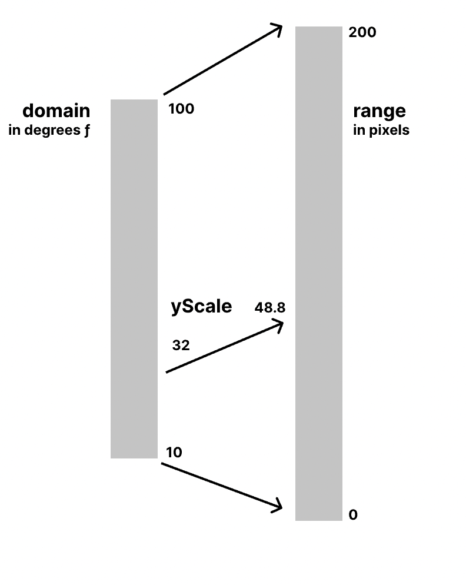

# D3 - Data Driven Documents

## Homework

Replicate the simple bar chart using data from the table at the top of the page.

## D3 Selections

[D3 Selections](https://github.com/d3/d3-selection) are similar to native JavaScript selections (`document.querySelector`) but are optimized for data visualization.

- `d3.select('css selector')` is similar to `document.querySelector('css selector')`
- `d3.selectAll('css selector')` is similar to `document.querySelectorAll('css selector')`

```html
<body>
  <ul>
    <li>one</li>
    <li>two</li>
    <li>three</li>
    <li>four</li>
  </ul>
  <script>
    let testOne = d3.select("ul");
    let testTwo = document.querySelector("ul");
    console.log(testOne);
    console.dir(testTwo);
    let testThree = d3.selectAll("li");
    let testFour = document.querySelectorAll("li");
    console.dir(testThree);
    console.log(testFour);
  </script>
</body>
```

Once you have a selection in D3 you use dot chaining to perform actions.

```js
d3.select("li").text("Hello Worldwide ");
document.querySelector("li+li").innerText = "foo bar";
```

Note: CSS selectors can also be child selectors:

```js
d3.select("li:first-child").text("Hello again! ");
document.querySelector("li:nth-child(3)").innerText = "Yay number 3!";
```

## Test in an HTML Table

Add the following HTML table to the playground:

```html
<div class="container">
  <h2>Weather Forecast</h2>
  <table class="table table-hover">
    <thead>
      <tr class="head">
        <th scope="col" class="head-date">Date</th>
        <th scope="col" class="head-temp-low">Low</th>
        <th scope="col" class="head-temp-high">High</th>
      </tr>
    </thead>
    <tbody>
      <tr class="day">
        <th scope="row" class="day-date">03/30/2021</th>
        <td class="day-low">
          <span class="temp">87</span>&deg; <span class="notation">F</span>
        </td>
        <td class="day-high">
          <span class="temp">68</span>&deg; <span class="notation">F</span>
        </td>
      </tr>
      <tr class="day">
        <th scope="row" class="day-date">04/01/2021</th>
        <td class="day-low">
          <span class="temp">64</span>&deg; <span class="notation">F</span>
        </td>
        <td class="day-high">
          <span class="temp">85</span>&deg; <span class="notation">F</span>
        </td>
      </tr>
      <tr class="day">
        <th scope="row" class="day-date">04/02/2021</th>
        <td class="day-low">
          <span class="temp">65</span>&deg; <span class="notation">F</span>
        </td>
        <td class="day-high">
          <span class="temp">89</span>&deg; <span class="notation">F</span>
        </td>
      </tr>
      <tr class="day">
        <th scope="row" class="day-date">04/03/2021</th>
        <td class="day-low">
          <span class="temp">69</span>&deg; <span class="notation">F</span>
        </td>
        <td class="day-high">
          <span class="temp">90</span>&deg; <span class="notation">F</span>
        </td>
      </tr>
      <tr class="day">
        <th scope="row" class="day-date">04/04/2021</th>
        <td class="day-low">
          <span class="temp">65</span>&deg; <span class="notation">F</span>
        </td>
        <td class="day-high">
          <span class="temp">88</span>&deg; <span class="notation">F</span>
        </td>
      </tr>
    </tbody>
  </table>
</div>
```

Note: the HTML above is set to work with [Bootstrap](https://getbootstrap.com).

Try one at a time:

```js
d3.select(".temp").text("hot");
d3.selectAll(".temp").text("hot");
d3.selectAll(".day-high .temp").text("hot");
d3.selectAll("tr:nth-child(1) .day-high .temp").text("hot");
```

Common D3 methods for modifying attributes and styles include:

- style()
- classed()
- attr()
- property()

Modify attributes and styles:

```js
d3.selectAll("tr:nth-child(1) .day-high .temp").attr("style", "color: red");
d3.selectAll("tr:nth-child(1) .day-high .temp").attr("class", "hot");
```

```js
const even = d3.selectAll("tr:nth-child(even)");
even.attr("style", "background-color: #ddd");
```

Common D3 methods for modifying selections include:

- text()
- html()
- append()
- insert()
- remove()

```js
d3.selectAll("tr:nth-child(4) .day-high")
  .append("span")
  .html("hot")
  .style("background", "red")
  .style("padding", "3px")
  .style("margin-left", "3px")
  .style("border-radius", "3px")
  .style("color", "white");
```

```js
d3.selectAll("tr:nth-child(1) .day-high .temp")
  .attr("class", "hot")
  .html("hot! ");
```

Is equivalent to:

```js
d3.selectAll("tr:nth-child(1) .day-high .temp")
  .classed("hot", true)
  .html("hot! ");
```

- append

```js
d3.selectAll("tr:nth-child(1) .day-high .temp")
  .append("span")
  .html(" high temp");
```

Note the chaining here. Try append instead of insert.

```js
d3.selectAll("tr:nth-child(1) .day-high .temp")
  .html("<strong>20</strong>")
  .insert("span", "strong")
  .classed("hot", true)
  .text("high temp ");
```

- remove (What would happen if the order were reversed?)

```js
d3.select("tr:nth-child(5)").remove();
d3.select("tr:nth-child(4)").remove();
d3.select("tr:nth-child(3)").remove();
```

## Joining Data

One of the most important features of D3 is its ability is easily join data.

```js
d3.selectAll(".day-high .temp")
  .data([145, 78, 77, 66, 56])
  .html(function (d) {
    return d;
  });
```

Try with a template string:

```js
d3.selectAll(".day-high .temp")
  .data([145, 78, 77, 66, 56])
  .html(function (d) {
    return `<h1>${d}</h1>`;
  });
```

With an arrow function:

```js
d3.selectAll(".day-high .temp")
  .data([145, 78, 77, 66, 56])
  .html((d) => {
    return `<h1>${d}</h1>`;
  });
```

With an arrow function and implicit return:

```js
d3.selectAll(".day-high .temp")
  .data([145, 78, 77, 66, 56])
  .html((d) => `<h1>${d}</h1>`);
```

## Dynamic Data

Edit the HTML to remove the table body:

```html
<table class="table table table-hover">
  <thead>
    <tr class="head">
      <th scope="col" class="head-date">Date</th>
      <th scope="col" class="head-temp-low">Low</th>
      <th scope="col" class="head-temp-high">High</th>
    </tr>
  </thead>
  <tbody></tbody>
</table>
```

Dynamically insert some weather data and examine it with logging:

```js
var mydata = [
  { date: "4/01/2021", low: 55, high: 78 },
  { date: "4/02/2021", low: 65, high: 83 },
  { date: "4/03/2021", low: 77, high: 90 },
  { date: "4/04/2021", low: 58, high: 78 },
  { date: "4/05/2021", low: 67, high: 92 },
];

console.log(mydata[0]);
console.log(mydata[0].date);
for (let i = 0; i < mydata.length; i++) {
  console.log(`The high on ${mydata[i].date} was ${mydata[i]["high"]}`);
}
```

- bind the data:

```js
d3.select("tbody")
  .selectAll("tr") // doesn't exist yet
  .data(mydata)
  .enter() // enters the selection
  .append("tr")
  .html(function (d) {
    return `
      <th scope="row">${d.date}</th>
      <td>${d.low}</td>
      <td>${d.high}</td>
      `;
  });
```

An alternative with D3 [join()](https://github.com/d3/d3-selection/blob/main/README.md#selection_join):

```js
d3.select("tbody")
  .selectAll("tr") // doesn't exist yet
  .data(mydata)
  // .enter() // enters the selection
  .join("tr") // Appends elements to match the data that was bound
  .html(function (d) {
    return `
      <th scope="row">${d.date} </th>
      <td>${d.low}</td>
      <td>${d.high}</td>
      `;
  });
```

## Using D3 with SVG

Add the following HTML:

```html
<div id="root"></div>
```

```js
d3.select("#root")
  .append("svg")
  .attr("width", 600)
  .attr("height", 400)
  .style("background", "#93A1A1")
  .append("rect")
  .attr("x", 200)
  .attr("y", 100)
  .attr("height", 200)
  .attr("width", 200)
  .style("fill", "#CB4B19");

d3.select("#root svg")
  .append("circle")
  .attr("cx", 300)
  .attr("cy", 200)
  .attr("r", 50)
  .style("fill", "#840043");
```

<!-- ```js
const matrix = [
  [11975, 5871, 8916, 2868],
  [1951, 10048, 2060, 6171],
  [8010, 16145, 8090, 8045],
  [1013, 990, 940, 6907],
];

d3.select("body")
  .append("table")
  .selectAll("tr")
  .data(matrix)
  .join("tr")
  .selectAll("td")
  .data((d) => d)
  .join("td")
  .text((d) => d);
```

Sample: `https://observablehq.com/@d3/brushable-scatterplot` -->

## A Simple Bar Chart

```js
var bardata = [20, 30, 45, 15];
var height = 400,
  width = 600,
  barWidth = 50,
  barOffset = 5;

d3.select("#root")
  .append("svg")
  .attr("width", width)
  .attr("height", height)
  .style("background", "#C9D7D6")
  .selectAll("rect")
  .data(bardata)
  .enter()
  .append("rect")
  .style("fill", "#C61C6F")
  .attr("width", barWidth)
  .attr("height", function (d) {
    return d;
  })
  .attr("x", function (d, i) {
    return i * (barWidth + barOffset);
  })
  .attr("y", function (d) {
    return height - d;
  });
```

Updated to ES5:

```js
const bardata = [20, 30, 45, 15];
const dimensions = {
  height: 400,
  width: 600,
  barWidth: 50,
  barOffset: 5,
};

d3.select("#root")
  .append("svg")
  .attr("width", dimensions.width)
  .attr("height", dimensions.height)
  .style("background", "#C9D7D6")
  .selectAll("rect")
  .data(bardata)
  // .enter()
  .join("rect")
  .style("fill", "#C61C6F")
  .attr("width", dimensions.barWidth)
  .attr("height", (d) => d)
  .attr("x", (d, i) => i * (dimensions.barWidth + dimensions.barOffset))
  .attr("y", (d) => dimensions.height - d);
```

## D3 Methods for the Chart

A scale allows us to redefine data so that it fits a certain range of values.

### Linear Scale

The simplest scale is the Linear Scale - also known as a continuous scale - because it maps a set of input values to output values. We will use that to make our visualized data grow vertically to fit a specific range (the height of the SVG).

It needs two things:

- the domain is an array of values that you feed to your scale
- the range represents the values that we want to scale our data to

```js
const yScale = d3
  .scaleLinear()
  .domain([0, d3.max(bardata)])
  .range([0, dimensions.height]);
```

```js
  .join("rect")
  .style("fill", "#C61C6F")
  .attr("width", dimensions.barWidth)
  .attr("height", (d) => yScale(d)) // NEW
  .attr("x", (d, i) => i * (dimensions.barWidth + dimensions.barOffset))
  .attr("y", (d) => dimensions.height - yScale(d)); // NEW

  console.log(yScale(bardata[0]));
```

Note: examine the DOM. The height of a bar plus the y value will equal 400. The x value uses dimensions.offset to position the bar on the x (horizontal) axis.

When you have values that have some inherent order, you use an ordinal scale.

In a bar chart the horizontal axis is often used to compare data over things like a period of time, so the relationship between the items is important. D3 provides a number of ordinal scales. The simplest one is a band scale (scaleBand) that allows you to create regular bar charts from data and manage the space in between them.

We'll need to specify a domain and a range as well as a couple of additional methods to control the spacing in between our bars:

```js
const xScale = d3
  .scaleBand()
  .domain(bardata)
  .paddingInner(0.3)
  .paddingOuter(0.1)
  .range([0, dimensions.width]);
```

```js
// .attr("x", (d, i) => i * (dimensions.barWidth + dimensions.barOffset))
.attr("x", function (d) {
 return xScale(d);
})
```

## A D3 Line Chart

In this module, we'll create a line chart that plots daily temperature using d3.

Here's what our [line chart](https://dataviz-exercises.netlify.app/temperatures/index.html) will look like once we're finished.

The dataset we'll be analyzing contains 365 days of daily weather metrics. The file is in [JSON]() format and includes 2021 weather data for New York City from the Open Sky weather API.

Create `index.html` in the app folder and add a wrapper div and a link to D3 and `chart.js`:

```html
<!DOCTYPE html>
<html lang="en">
  <head>
    <meta charset="UTF-8" />
    <meta http-equiv="X-UA-Compatible" content="IE=edge" />
    <meta name="viewport" content="width=device-width, initial-scale=1.0" />
    <title>Document</title>
  </head>
  <body>
    <div id="wrapper"></div>

    <script src="https://d3js.org/d3.v7.min.js"></script>
    <script src="chart.js"></script>
  </body>
</html>
```

Open the page using Live Server.

## Loading the Data

In `chart.js` define a function named `drawLineChart()` and run it:

```js
async function drawLineChart() {
  document.body.innerText = d3.version;
}

drawLineChart();
```

The first step to visualizing any dataset is understanding its structure. To get a good look at our data we will load the JSON file that holds our data.

D3.js has methods for fetching and parsing files of different formats in the [d3-fetch module](https://github.com/d3/d3-fetch) - i.e. `d3.csv()`, `d3.json()`, and `d3.tsv()`.

Create a new variable `dataset` and use `d3.json()` to load the contents of our JSON file:

```js
async function drawLineChart() {
  const dataset = await d3.json("./data/my_weather_data.json");
  console.log(dataset);
}

drawLineChart();
```

Open `index.html` using Live Server and examine the console.

`await` is a JavaScript keyword that allows JS to run while a long running task takes place in the background.

> Asynchronous programming is a technique that enables your program to start a potentially long-running task and still be able to be responsive to other events while that task runs, rather than having to wait until that task has finished. Once that task has finished, your program is presented with the result. - [MDN](https://developer.mozilla.org/en-US/docs/Learn/JavaScript/Asynchronous)

Try running the demo on [MDN](https://developer.mozilla.org/en-US/docs/Learn/JavaScript/Asynchronous/Introducing#a_long-running_synchronous_function).

Note that the `drawLineChart()` function declaration is preceded by the keyword `async`. `await` will only work within an function maked as `async`.

Demo: `console.log` fires before the data set is available

```js
function drawLineChart() {
  const dataset = d3.json("./data/my_weather_data.json");
  console.log(dataset);
}

drawLineChart();
```

## Examine the Data

Our dataset is array of objects, with one object per day.

Send the first day to the console in tabular form:

`console.table(dataset[0])`

We'll start by looking at `temperatureMax` over time.

Our timeline will have two axes:

1. a y axis (vertical) on the left comprised of max temperature values
1. an x axis (horizontal) on the bottom comprised of dates

To grab the correct metrics from each data point, we'll use `accessor functions`.

Accessor functions convert a single data point into the metric value.

> Think of a dataset as a table. A data point would be a row in that table. In this case, a data point represents an object in our dataset array that holds the weather data for one day.

We'll create a `yAccessor` function that will take a data point and return the max temperature.

We will use `yAccessor` for plotting points on the y axis.

Looking at the data point in our console, we can see that a day's max temperature is located on the object's `temperatureMax` key. To access this value, our yAccessor function looks like this:

```js
async function drawLineChart() {
  const dataset = await d3.json("./data/my_weather_data.json");
  const yAccessor = (d) => d.temperatureMax;
  console.log(yAccessor); // yAccessor is a variable pointing to a function
  console.log(yAccessor(dataset[0])); // is the first max temp in dataset
}

drawLineChart();
```

Next, we'll need an `xAccessor` function that will return a point's date, which we will use for plotting points on the x axis.

```js
const xAccessor = (d) => d.date;
console.log(xAccessor(dataset[0]));
```

The date value in our dataset is a string - `"date": "2021-01-01"`

This string won't work in JavaScript. _We_ know how far "2021-12-25" is from "2021-12-29" but a computer needs a date in a form it can work with.

A JavaScript `Date` objects represent a single moment in time in a platform-independent format

We need to convert our dataset strings into JavaScript Dates. d3 has a [d3-time-format](https://github.com/d3/d3-time-format) module with methods for parsing and formatting dates.

The `d3.timeParse()` method takes a string specifying a date format, and outputs a function that will parse dates of that format.

For example, `d3.timeParse("%Y")` will parse a string (create a Date object) with just a year (e.g. "2021").

Let's create a date parser function and use it to transform our date strings into date objects:

```js
async function drawLineChart() {
  const dataset = await d3.json("./data/my_weather_data.json");

  const yAccessor = (d) => d.temperatureMax;
  // NEW
  const dateParser = d3.timeParse("%Y-%m-%d");
  // NEW
  const xAccessor = (d) => dateParser(d.date);
  console.log(xAccessor(dataset[0]));
}

drawLineChart();
```

When we call `xAccessor(dataset[0])` we get the first day's date as a [JavaScript Date object](https://developer.mozilla.org/en-US/docs/Web/JavaScript/Reference/Global_Objects/Date).

### Why Accessor Functions?

As we will see, defining accessor functions are a best practice.

Creating separate functions to read the values from our data points helps us in a many ways:

- Easy changes: every chart is likely to change — whether that change is due to business requirements, design, or data structure. These changing requirements are especially prevalent when creating dashboards with dynamic data, where you might need to handle a new edge case two months later. Having accessor functions in one place in a chart file makes them easy to update.
- Documentation: having these functions at the top of a file can give you a quick reminder of what metrics the chart is plotting and the structure of the data.
- Framing: sitting down with the data and planning what metrics you need to access is a great way to start making a chart. It prevents you from rushing in only to realize later that another type of chart would be better suited to the data.

## Chart Layout

When drawing a chart, there are two containers whose dimensions we need to define: the wrapper and the bounds.


The `wrapper` contains the entire chart: the data elements, the axes, the labels, etc.

The `bounds` contain all of our data elements (in this case, our graph line).

This distinction will help us separate the amount of space we need for extraneous elements (axes, labels), and let us focus on our main task: plotting our data.

When adding a chart to a webpage, we start with the amount of space we have available for the chart. Then we decide how much space we need for the margins, which will accommodate the chart axes and labels. What's left is how much space we have for our data elements.

> A quick note on JavaScript objects:

```js
let arr = [1, "text", true];
console.log(arr[2]);
console.log(typeof arr[2]);

let obj = {
  a: 1,
  b: 2,
};

console.log(obj.a);

obj.c = 3;

delete obj.a;
```

Define a dimensions object that will contain the size of the wrapper and the margins. We'll have one margin defined for each side of the chart: top, right, bottom, and left.

```js
let dimensions = {
  width: window.innerWidth * 0.9,
  height: 400,
  margin: {
    top: 15,
    right: 15,
    bottom: 40,
    left: 60,
  },
};
```

We want a small top and right margin to give the chart some space and a larger bottom and left margin to create room for our axes.

Let's compute the size of our bounds and add that to our dimensions object.

```js
async function drawLineChart() {
  const dataset = await d3.json("./data/my_weather_data.json");

  const yAccessor = (d) => d.temperatureMax;
  const dateParser = d3.timeParse("%Y-%m-%d");
  const xAccessor = (d) => dateParser(d.date);

  // 2. Create chart dimensions

  let dimensions = {
    width: window.innerWidth * 0.9,
    height: 400,
    margin: {
      top: 15,
      right: 15,
      bottom: 40,
      left: 60,
    },
  };

  // NEW
  dimensions.boundedWidth =
    dimensions.width - dimensions.margin.left - dimensions.margin.right;
  dimensions.boundedHeight =
    dimensions.height - dimensions.margin.top - dimensions.margin.bottom;

  console.log(dimensions);
}

drawLineChart();
```

<!--
### Note on Variable Scope.

> We cannot access the dimensions variable in the browser's console because it is inside our `drawLineChart` function. Variables are [scoped](https://developer.mozilla.org/en-US/docs/Glossary/Scope) to the function. It is unnecessary here but if we wanted to make `dimensions` available in the console we could add it as shown:

```js
if (!window.dimensions) {
  window.dimensions = dimensions;
}
``` -->

## Adding Elements

We'll use the #wrapper element to add elements to our page.

In previous lessons we used `document.querySelector()` to select an element on the page. D3's [d3-selection](https://github.com/d3/d3-selection) module has helper functions to select and modify the DOM.

`d3.select()` accepts a CSS selector and returns the first matching DOM element (if any):

`const wrapper = d3.select("#wrapper")`

```js
async function drawLineChart() {
  const dataset = await d3.json("./data/my_weather_data.json");

  const yAccessor = (d) => d.temperatureMax;
  const dateParser = d3.timeParse("%Y-%m-%d");
  const xAccessor = (d) => dateParser(d.date);

  // 2. Create chart dimensions

  let dimensions = {
    width: window.innerWidth * 0.9,
    height: 400,
    margin: {
      top: 15,
      right: 15,
      bottom: 40,
      left: 60,
    },
  };
  dimensions.boundedWidth =
    dimensions.width - dimensions.margin.left - dimensions.margin.right;
  dimensions.boundedHeight =
    dimensions.height - dimensions.margin.top - dimensions.margin.bottom;

  // 3. Draw canvas

  const wrapper = d3.select("#wrapper");
  const svg = wrapper.append("svg");
  console.log(wrapper, svg);
}

drawLineChart();
```

```css
<style>
  svg {
    border: 1px solid #333;
  }
</style>
```

Unlike `document.querySelector` d3.select() returns a d3 selection object specially configured to work within the d3 system.

Expand the `_groups` key, and note that the linked element is our new <svg> element.

Hover over the <svg> element and the browser will highlight the corresponding DOM element on the webpage and show the element's size: 300px by 150px - the default size for SVG elements in Google Chrome.

D3 selection objects have an `.attr()` method that will add or replace an attribute on the selected DOM element. The first argument is the attribute name and the second argument is the value.

```js
const wrapper = d3.select("#wrapper");
const svg = wrapper.append("svg");
svg.attr("width", dimensions.width);
svg.attr("height", dimensions.height);
```

> The value argument to .attr() can either be a constant (all we need right now) or a function, (which we'll need later).

### A Note on Style

Most d3-selection methods will return a selection object.

- any method that selects or creates a new object will return the new selection
- any method that manipulates the current selection will return the same selection

This allows us to keep our code concise by chaining. We can rewrite the above code as:

```js
const wrapper = d3.select("#wrapper");
const svg = wrapper
  .append("svg")
  .attr("width", dimensions.width)
  .attr("height", dimensions.height);
```

Since we're not going to re-use the svg variable, we can rewrite the above code as:

```js
const wrapper = d3
  .select("#wrapper")
  .append("svg")
  .attr("width", dimensions.width)
  .attr("height", dimensions.height);
```

The code so far:

```js
async function drawLineChart() {
  const dataset = await d3.json("./data/my_weather_data.json");

  const yAccessor = (d) => d.temperatureMax;
  const dateParser = d3.timeParse("%Y-%m-%d");
  const xAccessor = (d) => dateParser(d.date);

  // 2. Create chart dimensions

  let dimensions = {
    width: window.innerWidth * 0.9,
    height: 400,
    margin: {
      top: 15,
      right: 15,
      bottom: 40,
      left: 60,
    },
  };
  dimensions.boundedWidth =
    dimensions.width - dimensions.margin.left - dimensions.margin.right;
  dimensions.boundedHeight =
    dimensions.height - dimensions.margin.top - dimensions.margin.bottom;

  // 3. Draw canvas

  const wrapper = d3
    .select("#wrapper")
    .append("svg")
    .attr("width", dimensions.width)
    .attr("height", dimensions.height);
}

drawLineChart();
```

## Margins

We want our chart to respect the margins we specified.

Create a group - `<g>` - that shifts its contents using the CSS transform property to respect the top and left margins so we can deal with those in one place.

d3 selection objects have a `.style()` method for adding and modifying CSS styles. The .style() method is invoked similarly to .attr() and takes a key-value pair as its first and second arguments:

```js
const bounds = wrapper
  .append("g")
  .style(
    "transform",
    `translate(${dimensions.margin.left}px, ${dimensions.margin.top}px)`
  );
```

The `<g>` element size is 0px by 0px — instead of taking a width or height attribute, a <g> element will expand to fit its contents.

So far:

```js
async function drawLineChart() {
  const dataset = await d3.json("./data/my_weather_data.json");

  const yAccessor = (d) => d.temperatureMax;
  const dateParser = d3.timeParse("%Y-%m-%d");
  const xAccessor = (d) => dateParser(d.date);

  // 2. Create chart dimensions

  let dimensions = {
    width: window.innerWidth * 0.9,
    height: 400,
    margin: {
      top: 15,
      right: 15,
      bottom: 40,
      left: 60,
    },
  };
  dimensions.boundedWidth =
    dimensions.width - dimensions.margin.left - dimensions.margin.right;
  dimensions.boundedHeight =
    dimensions.height - dimensions.margin.top - dimensions.margin.bottom;

  // 3. Draw canvas

  const wrapper = d3
    .select("#wrapper")
    .append("svg")
    .attr("width", dimensions.width)
    .attr("height", dimensions.height);

  const bounds = wrapper
    .append("g")
    .style(
      "transform",
      `translate(${dimensions.margin.left}px, ${dimensions.margin.top}px)`
    );
}

drawLineChart();
```

Note: temporarily visualize the `g` element by appending a `rect` (groups cannot be filled or stroked):

```js
const bounds = wrapper
  .append("g")
  .style(
    "transform",
    `translate(${dimensions.margin.left}px, ${dimensions.margin.top}px)`
  )
  // NEW / TEMPORARY
  .append("rect")
  .attr("width", `${dimensions.boundedWidth}px`)
  .attr("height", `${dimensions.boundedHeight}px`)
  .attr("fill", "green");
```

Add a small circle to our SVG to remind us of the coordinate system:

```js
const measurement = wrapper
  .append("g")
  .style(
    "transform",
    `translate(${dimensions.margin.left}px, ${dimensions.margin.top}px)`
  )
  .append("circle")
  .attr("cx", 0)
  .attr("cy", 0)
  .attr("r", "12")
  .attr("fill", "red");
```

## Relative Scales

On our y axis, we want to plot the max temperature for every day.

Before we draw our chart, we need to decide what temperatures we want to visualize.

Do we need to plot temperatures over 1,000°F or under 0°F? We could hard-code a standard set of temperatures, but that range could be too large (making the data hard to see), or it could be too small or offset (cutting off the data).

Instead, let's use the actual range by finding the lowest and highest temperatures in our dataset.

> We've all seen over-dramatized timelines with a huge drop, only to realize that the change is relatively small. When defining an axis, we'll often want to start at 0 to show scale. We'll go over this more when we talk about types of data.

As an example, let's grab a sample day's data — say it has a maximum temperature of 55°F. We could draw our point 55 pixels above the bottom of the chart, but that won't scale with our boundedHeight.

If our lowest temperature is below 0 we would have to plot that value below the chart. Our y axis wouldn't be able to handle all of our temperature values.

To plot the max temperature values in the correct spot, we need to convert them into pixel space.

D3's [d3-scale](https://github.com/d3/d3-scale) module can create different types of scales.

_A scale is a function that converts values between two domains._

For our y axis, we want to convert values from the temperature domain to the pixel domain. If our chart needs to handle temperatures from 10°F to 100°F, a day with a max of 55°F will be halfway up the y axis.

Let's create a scale that converts those degrees into a y value. If our y axis is 200px tall, the y scale should convert 55°F into 100, the halfway point on the y axis.

<!--  -->


Test d3 scales:

```js
const temperatureRange = [0, 100];
const yHeight = [0, 600];

var linearScale = d3.scaleLinear().domain(temperatureRange).range(yHeight);
console.log(linearScale(0));
console.log(linearScale(50));
console.log(linearScale(100));

console.log(linearScale.invert(300));
```

`d3-scale` can handle many different types of scales. We want to use a linear scale because our y axis values will be numbers that increase linearly. To create a new scale, we create an instance of d3.scaleLinear().

Our scale needs two pieces of information:

1. the domain: the minimum and maximum input values
2. the range: the minimum and maximum output values

Let's start with the domain. We'll need to create an array of the smallest and largest numbers our y axis will need to handle — in this case the lowest and highest max temperature in our dataset.

The [d3-array](https://github.com/d3/d3-array) module has a `d3.extent()` method for grabbing those numbers. `d3.extent()` takes two parameters:

1. an array of data points
2. an accessor function which defaults to an identity function (d => d)

Let's test this out by logging `d3.extent(dataset, yAccessor)` to the console.

```js
console.log(d3.extent(dataset, yAccessor));
```

The output is an array of two values: the minimum and maximum temperature in our dataset.

Let's plug that into a scale's domain:

```js
const yScale = d3.scaleLinear().domain(d3.extent(dataset, yAccessor));
```

Next we specify the range. The range is the highest and lowest number we want our scale to output — in this case, the maximum & minimum number of pixels our point will be from the x axis.

We will use our `boundedHeight` to stay within our margins. Remember, SVG y-values count from top to bottom so we want our range to start at the top.

```js
const yScale = d3
  .scaleLinear()
  .domain(d3.extent(dataset, yAccessor))
  .range([dimensions.boundedHeight, 0]);
```

Let's test it by logging some values to the console. At what y value is the freezing point on our chart?

```js
console.log(yScale(32));
```

The logged number should tell us how far away the freezing point will be from the top of the svg.

Let's visualize this by adding a rectangle covering all temperatures below freezing using the SVG <rect> element. We need to give it four attributes: x, y, width, and height.

```js
const freezingTemperaturePlacement = yScale(32);
const freezingTemperatures = bounds
  .append("rect")
  .attr("x", 0)
  .attr("width", dimensions.boundedWidth)
  .attr("y", freezingTemperaturePlacement)
  .attr("height", dimensions.boundedHeight - freezingTemperaturePlacement);
```

The black rectangle spans the width of our bounds.

Make it a light blue to connote freezing and decrease its visual importance.

```js
const freezingTemperatures = bounds
  .append("rect")
  .attr("x", 0)
  .attr("width", dimensions.boundedWidth)
  .attr("y", freezingTemperaturePlacement)
  .attr("height", dimensions.boundedHeight - freezingTemperaturePlacement)
  // NEW
  .attr("fill", "#87ceed");
```

Drop down the rectangle in the Elements panel to examine the `.attr()` methods on the rect.

E.g.:

```js
<rect
  x="0"
  width="735.9"
  y="264.34844192634563"
  height="80.65155807365437"
  fill="#87ceed"
></rect>
```

> Some SVG styles can be set with either a CSS style or an attribute value such as fill, stroke, and stroke-width. It's up to you whether you want to set them with .style() or .attr(). Once we're familiar with styling our charts, we'll apply classes using `.attr("class", "class-name")` and add styles using CSS.

> We're using .attr() to set the fill because an attribute has a lower CSS precedence than linked stylesheets, which will let us overwrite the value. If we used `.style()` we'd be setting an inline style which would require an `!important` CSS declaration to override.

## JavaScript Dates and Scales

```js
let date1 = new Date();
let start = Date.now();
let date2 = new Date("December 17, 1995 03:24:00");
let date3 = new Date(2021, 0, 1);
```

Run the below in the playground:

```js
console.log(new Date(2021, 0, 1));

var timeScale = d3
  .scaleTime()
  .domain([new Date(2021, 0, 1), new Date()])
  .range([0, 100]);

console.log(timeScale(new Date(2021, 0, 15)));
console.log(timeScale(new Date(2021, 3, 15)));
console.log(timeScale(new Date()));

console.log(timeScale.invert(50));
```

Note: in JavaScript months start at 0. Invert returns the date from a number within our range.

Create a scale for the x axis. This will look like our y axis but, since we're working with date objects, we'll use a time scale which knows how to handle date objects.

```js
const xScale = d3
  .scaleTime()
  .domain(d3.extent(dataset, xAccessor))
  .range([0, dimensions.boundedWidth]);
```

Code to this point:

```js
async function drawLineChart() {
  const dataset = await d3.json("./data/my_weather_data.json");

  const yAccessor = (d) => d.temperatureMax;
  const dateParser = d3.timeParse("%Y-%m-%d");
  const xAccessor = (d) => dateParser(d.date);

  // 2. Create chart dimensions

  let dimensions = {
    width: window.innerWidth * 0.9,
    height: 400,
    margin: {
      top: 15,
      right: 15,
      bottom: 40,
      left: 60,
    },
  };
  dimensions.boundedWidth =
    dimensions.width - dimensions.margin.left - dimensions.margin.right;
  dimensions.boundedHeight =
    dimensions.height - dimensions.margin.top - dimensions.margin.bottom;

  // 3. Draw canvas

  const wrapper = d3
    .select("#wrapper")
    .append("svg")
    .attr("width", dimensions.width)
    .attr("height", dimensions.height);

  const bounds = wrapper
    .append("g")
    .style(
      "transform",
      `translate(${dimensions.margin.left}px, ${dimensions.margin.top}px)`
    );

  // 4. Create scales

  const yScale = d3
    .scaleLinear()
    .domain(d3.extent(dataset, yAccessor))
    .range([dimensions.boundedHeight, 0]);

  const freezingTemperaturePlacement = yScale(32);
  const freezingTemperatures = bounds
    .append("rect")
    .attr("x", 0)
    .attr("width", dimensions.boundedWidth)
    .attr("y", freezingTemperaturePlacement)
    .attr("height", dimensions.boundedHeight - freezingTemperaturePlacement)
    .attr("fill", "#e0f3f3");

  const xScale = d3
    .scaleTime()
    .domain(d3.extent(dataset, xAccessor))
    .range([0, dimensions.boundedWidth]);
}

drawLineChart();
```

## Drawing the Timeline

The timeline itself will be a single _path_ SVG element. As we have seen, path elements take a `d` (data) attribute that creates the shape.

E.g.:

```js
<svg width="640" height="480">
  <path
    d="M20,230 Q40,205 50,230 T90,230"
    fill="none"
    stroke="blue"
    stroke-width="5"
  />
</svg>
```

[d3-shape](https://github.com/d3/d3-shape) has a `d3.line()` method that creates a generator that converts data points into a d string:

`const lineGenerator = d3.line()`

Our generator needs two pieces of information:

1. how to find an x axis value
2. how to find a y axis value

We set these values with the x and y method, respectively, which each take one parameter: a function to convert a data point into an x or y value.

We want to use our accessor functions, but _our accessor functions return the unscaled value_ so we'll transform our data point with both the accessor function and the scale to get the scaled value in pixel space.

```js
const lineGenerator = d3
  .line()
  .x((d) => xScale(xAccessor(d)))
  .y((d) => yScale(yAccessor(d)));
```

Now we're ready to add the path element to our bounds.

Feed our dataset to our line generator to create the d attribute and tell the line what shape to be.

```js
const line = bounds.append("path").attr("d", lineGenerator(dataset));
```

We have a chart with a line showing our max temperature for the whole year.

SVG elements default to a black fill and no stroke, which is why we see this dark filled-in shape.

```js
const line = bounds
  .append("path")
  .attr("d", lineGenerator(dataset))
  .attr("fill", "none")
  .attr("stroke", "steelblue")
  .attr("stroke-width", 2);
```

Code so far:

```js
import * as d3 from "d3";

async function drawLineChart() {
  const dataset = await d3.json("./data/my_weather_data.json");

  const yAccessor = (d) => d.temperatureMax;
  const dateParser = d3.timeParse("%Y-%m-%d");
  const xAccessor = (d) => dateParser(d.date);

  // 2. Create chart dimensions

  let dimensions = {
    width: window.innerWidth * 0.9,
    height: 400,
    margin: {
      top: 15,
      right: 15,
      bottom: 40,
      left: 60,
    },
  };
  dimensions.boundedWidth =
    dimensions.width - dimensions.margin.left - dimensions.margin.right;
  dimensions.boundedHeight =
    dimensions.height - dimensions.margin.top - dimensions.margin.bottom;

  // 3. Draw canvas

  const wrapper = d3
    .select("#wrapper")
    .append("svg")
    .attr("width", dimensions.width)
    .attr("height", dimensions.height);

  const bounds = wrapper
    .append("g")
    .style(
      "transform",
      `translate(${dimensions.margin.left}px, ${dimensions.margin.top}px)`
    );

  // 4. Create scales

  const yScale = d3
    .scaleLinear()
    .domain(d3.extent(dataset, yAccessor))
    .range([dimensions.boundedHeight, 0]);

  const freezingTemperaturePlacement = yScale(32);
  const freezingTemperatures = bounds
    .append("rect")
    .attr("x", 0)
    .attr("width", dimensions.boundedWidth)
    .attr("y", freezingTemperaturePlacement)
    .attr("height", dimensions.boundedHeight - freezingTemperaturePlacement)
    .attr("fill", "#e0f3f3");

  const xScale = d3
    .scaleTime()
    .domain(d3.extent(dataset, xAccessor))
    .range([0, dimensions.boundedWidth]);

  // 5. Draw data

  const lineGenerator = d3
    .line()
    .x((d) => xScale(xAccessor(d)))
    .y((d) => yScale(yAccessor(d)));

  const line = bounds
    .append("path")
    .attr("d", lineGenerator(dataset))
    .attr("fill", "none")
    .attr("stroke", "steelblue")
    .attr("stroke-width", 2);
}

drawLineChart();
```

## Drawing the Axes

Start with the y axis.

d3's [d3-axis](https://github.com/d3/d3-axis) module has axis generator methods which will draw an axis for the given scale.

Unlike the methods we've used before, d3 axis generators will append multiple elements to the page.

There is one method for each orientation, which will specify the placement of labels and tick marks:

- axisTop
- axisRight
- axisBottom
- axisLeft

Following common convention, we want the labels of our y axis to be to the left of the axis line, so we'll use `d3.axisLeft()` and pass it our yScale.

```js
const yAxisGenerator = d3.axisLeft().scale(yScale);
```

When we call our axis generator, it will create a lot of elements — let's create a g element to hold all of those elements and keep our DOM organized. Then we'll pass that new element to our yAxisGenerator function to tell it where to draw our axis.

```js
const yAxis = bounds.append("g");

yAxisGenerator(yAxis);
```

This method works but it will break up our chained methods. To fix this, d3 selections have a .`call()` method that will execute the provided function with the selection as the first parameter.

We use `.call()` to:

- prevent saving our selection as a variable
- preserve the selection for additional chaining

Note that this code does exactly the same thing as the snippet above - we pass the function `yAxisGenerator` to `.call()`, which then runs the function.

```js
const yAxis = bounds.append("g").call(yAxisGenerator);
```

The small lines perpendicular to the axis are called tick marks. D3 has made behind-the-scenes decisions about how many tick marks to make and how far apart to draw them. We'll customize this in later sessions.

Create the x axis in the same way, this time using `d3.axisBottom()`.

```js
const xAxisGenerator = d3.axisBottom().scale(xScale);
```

Create another <g> element and draw our axis.

```js
const xAxis = bounds.append("g").call(xAxisGenerator);
```

It's a good idea to create a <g> element to contain our axis elements for three reasons:

1. to keep our DOM organized, for debugging or exporting
2. if we want to remove or update our axis, we'll want an easy way to target all of the elements
3. modifying our whole axis at once, for example when we want to move it around.

The axis looks right, but it's in the wrong place.

Why didn't `.axisBottom()` draw the axis in the right place? D3's axis generator functions know where to place the tick marks and tick labels relative to the axis line but they have no idea where to place the axis itself.

To move the x axis to the bottom, we can shift the x axis group, similar to how we shifted our chart bounds using a CSS transform.

```js
const xAxis = bounds
  .append("g")
  .call(xAxisGenerator)
  .style("transform", `translateY(${dimensions.boundedHeight}px)`);
```

Final:

```js
async function drawLineChart() {
  // 1. Access data
  const dataset = await d3.json("./data/my_weather_data.json");

  const yAccessor = (d) => d.temperatureMax;
  const dateParser = d3.timeParse("%Y-%m-%d");
  const xAccessor = (d) => dateParser(d.date);

  // 2. Create chart dimensions

  let dimensions = {
    width: window.innerWidth * 0.9,
    height: 400,
    margin: {
      top: 15,
      right: 15,
      bottom: 40,
      left: 60,
    },
  };
  dimensions.boundedWidth =
    dimensions.width - dimensions.margin.left - dimensions.margin.right;
  dimensions.boundedHeight =
    dimensions.height - dimensions.margin.top - dimensions.margin.bottom;

  // 3. Draw canvas

  const wrapper = d3
    .select("#wrapper")
    .append("svg")
    .attr("width", dimensions.width)
    .attr("height", dimensions.height);

  const bounds = wrapper
    .append("g")
    .style(
      "transform",
      `translate(${dimensions.margin.left}px, ${dimensions.margin.top}px)`
    );

  // 4. Create scales

  const yScale = d3
    .scaleLinear()
    .domain(d3.extent(dataset, yAccessor))
    .range([dimensions.boundedHeight, 0]);

  const freezingTemperaturePlacement = yScale(32);
  const freezingTemperatures = bounds
    .append("rect")
    .attr("x", 0)
    .attr("width", dimensions.boundedWidth)
    .attr("y", freezingTemperaturePlacement)
    .attr("height", dimensions.boundedHeight - freezingTemperaturePlacement)
    .attr("fill", "#e0f3f3");

  const xScale = d3
    .scaleTime()
    .domain(d3.extent(dataset, xAccessor))
    .range([0, dimensions.boundedWidth]);

  // 5. Draw data

  const lineGenerator = d3
    .line()
    .x((d) => xScale(xAccessor(d)))
    .y((d) => yScale(yAccessor(d)));

  const line = bounds
    .append("path")
    .attr("d", lineGenerator(dataset))
    .attr("fill", "none")
    .attr("stroke", "#af9358")
    .attr("stroke-width", 2);

  // 6. Draw peripherals

  const yAxisGenerator = d3.axisLeft().scale(yScale);

  const yAxis = bounds.append("g").call(yAxisGenerator);

  const xAxisGenerator = d3.axisBottom().scale(xScale);

  const xAxis = bounds
    .append("g")
    .call(xAxisGenerator)
    .style("transform", `translateY(${dimensions.boundedHeight}px)`);
}
drawLineChart();
```

## Homework

Choose a dataset below to play with -- you'll want to pick one with a metric that changes over time.

Here are a few suggestions:

- look at how many colors Bob Ross used in his paintings over time
- look at how many opera performances there were for different composers, each year
- look at the height of newly constructed lighthouses over time

Make a copy of the timeline project, download the data, and import it into your new project.

> If the data is a csv file, you'll need to use d3.csv() instead of d3.json().

Go over the same steps we went through this week to make a timeline with this new data.

If you get stuck, review the notes or watch this week's videos again.

### Datasets

#### Bob Ross paintings

Info about ~400 paintings by Bob Ross

[info](https://github.com/jwilber/Bob_Ross_Paintings)

Metrics: painting number, image url, title, season, episode, # unique colors, YouTube link, colors used

[raw data](https://raw.githubusercontent.com/jwilber/Bob_Ross_Paintings/master/data/bob_ross_paintings.csv)

#### Opera performances

Info about six seasons of global opera performances (2012 - 2018).

[info](https://www.operabase.com/en)

Metrics: season start & end, composer name, date of birth & death, nationality, gender, work, type of work

[raw data](https://dataverse.harvard.edu/api/access/datafile/4145300)

#### Witch Trials

Data on more than 10 thousand witch trials & related battles in Europe.

[info](https://www.peterleeson.com/Witch_Trials.pdf)

Metrics about battles: name, date, location, war name, source

[raw data about battles](https://github.com/JakeRuss/witch-trials/blob/master/data/battles.csv)

Metrics about trials: year, tried, deaths, place, source

[raw data about trials](https://github.com/JakeRuss/witch-trials/blob/master/data/trials.csv)

#### First kisses

This is a list of artist Galen Beebe's 48 first kisses.

[info (a visual essay)](http://beebe-west.com/viz/kiss-list/)

Metrics: age comparison, where, when, gender, orientation, if it was their last kiss, their sun sign, and lots of subjective info like how much Galen enjoyed it

[raw data](https://github.com/jswest/kiss-list-refresh/blob/master/public/data.json.js)

#### UK Lighthouses

Info about more than 600 lighthouses & related buildings in England & Wales between 1514 - 1911. You'll need to convert the xlsx file to csv, there are lots of tools out there [like this one](https://cloudconvert.com/xlsx-to-csv).

[info](https://www.sciencedirect.com/science/article/pii/S2352340920308854)

Metrics: name, location, number of lights in different time periods, visibility, height, construction year

[raw data (under available files)](https://reshare.ukdataservice.ac.uk/854172/)

#### Penguins

A dataset about physical characteristics of penguins in three separate species.

[info](https://allisonhorst.github.io/palmerpenguins/)

Metrics: species, island, bill length & depth, flipper length, weight, sex

[raw data](https://github.com/ttimbers/palmerpenguins/blob/aef2d7c48466b88dcfe0832a67b0a270607f1737/inst/extdata/penguins.tsv)

#### MMA Fighter stats

Some good numeric data in here, looking at MMA fighters & boxers.

[info](https://www.biorxiv.org/node/677784.external-links.html)

Metrics: name, nickname, height, weight, reach, stance, wins, losses, draws, total fights, win percent

[raw data](https://osf.io/3fkma/)

#### Love Island contestants

Apparently there's a [British dating reality show called Love Island](<https://en.wikipedia.org/wiki/Love_Island_(2015_TV_series)>). Here's a dataset of info about each contestant.

[info](https://github.com/amynic/love-island-workshop)

Metrics: name, series year outcome, age, profession, where they live, gender, and lots of show-specific info

[raw data](https://github.com/amynic/love-island-workshop/blob/master/data%20vizualisation/love-island-historical-dataset.csv)

#### More datasets

Here are a few resources for finding interesting datasets:

[Data is Plural](https://docs.google.com/spreadsheets/d/1wZhPLMCHKJvwOkP4juclhjFgqIY8fQFMemwKL2c64vk/edit#gid=0)

[The Pudding datasets](https://github.com/the-pudding/data)

## Notes

A simple highcharts line chart.

```html
<!DOCTYPE html>
<html lang="en">
  <head>
    <meta charset="UTF-8" />
    <meta http-equiv="X-UA-Compatible" content="IE=edge" />
    <meta name="viewport" content="width=device-width, initial-scale=1.0" />
    <title>Document</title>
    <script src="https://code.highcharts.com/highcharts.js"></script>
  </head>

  <body>
    <div id="container" style="width: 100%; height: 400px"></div>
  </body>
  <script>
    Highcharts.chart("container", {
      title: {
        text: "U.S Solar Employment Growth",
      },
      yAxis: {
        title: {
          text: "Number of Employees",
        },
      },

      series: [
        {
          name: "Installation & Developers",
          data: [
            43934, 48656, 65165, 81827, 112143, 142383, 171533, 165174, 155157,
            161454, 154610,
          ],
        },
      ],
    });
  </script>
</html>
```

## Instructor Notes

### Quantize Scales

```js
(function () {
  var body = document.querySelector("body");
  body.style["fontFamily"] = "monospace";
  body.style["fontSize"] = "2em";
  console.log = function (x) {
    body.innerText += x + "\n";
  };
})();

var quantizeScale = d3
  .scaleQuantize()
  .domain([0, 100])
  .range(["red", "white", "green"]);

console.log(quantizeScale(22));
console.log(quantizeScale(50));
console.log(quantizeScale(88));

console.log(quantizeScale.invertExtent("white"));
```

### Ordinal Scales

```js
(function () {
  var body = document.querySelector("body");
  body.style["fontFamily"] = "monospace";
  body.style["fontSize"] = "2em";
  console.log = function (x) {
    body.innerText += x + "\n";
  };
})();

var ordinalScale = d3
  .scaleOrdinal()
  .domain(["poor", "good", "great"])
  .range(["red", "white", "green"]);

console.log(ordinalScale("good"));
console.log(ordinalScale("great"));
console.log(ordinalScale("poor"));
```

### Load and Inspect Data

Review this.

```js
(function () {
  var body = document.querySelector("body");
  body.style["fontFamily"] = "monospace";
  body.style["fontSize"] = "2em";
  console.log = function (x) {
    body.innerText += x + "\n";
  };
})();

d3.json("data/data.json", function (data) {
  var extent = d3.extent(data, function (d) {
    return d.age;
  });
  console.log(extent);

  var scale = d3.scaleLinear().domain(extent).range([0, 600]);

  console.log(scale(37));

  var ages = d3.set(data, function (d) {
    return d.age;
  });
  console.log(ages.values());
});
```

### Select DOM Elements

```html
<!DOCTYPE html>
<html lang="en">
  <head>
    <meta charset="UTF-8" />
    <title>Egghead D3 v4</title>
    <script src="//d3js.org/d3.v4.min.js"></script>
    <style>
      div {
        display: inline-block;
        border: 1px solid black;
      }
      a {
        display: block;
      }
    </style>
  </head>
  <body>
    <div class="title">
      <a href="#">About</a>
      <a href="#">Products</a>
      <a href="#">Contact</a>
    </div>

    <a class="action" href="#">Buy Now</a>

    <script>
      var div = d3.select("div");
      console.log(div.nodes());

      var divLinks = div.selectAll("a");
      console.log(divLinks.nodes());

      var secondLink = d3.selectAll("a:nth-child(2)");
      console.log(secondLink.nodes());

      var allLinks = d3.selectAll(document.links);
      console.log(allLinks.size());
    </script>
  </body>
</html>
```

### Modify DOM Elements

Review with getter and setter methods, coding style (chaining) and additional methods (style etc.)

```html
<!DOCTYPE html>
<html lang="en">
  <head>
    <meta charset="UTF-8" />
    <title>Egghead D3 v4</title>
    <script src="//d3js.org/d3.v4.min.js"></script>
    <style>
      div {
        display: inline-block;
        border: 1px solid black;
      }
      a {
        display: block;
      }
      .red {
        color: red;
      }
    </style>
  </head>
  <body>
    <div class="title">
      <a href="#">About</a>
      <a href="#">Products</a>
      <a href="#">Contact</a>
    </div>

    <a class="action" href="#">Buy Now</a>

    <script>
      d3.selectAll("a:nth-child(2)")
        .attr("href", "http://google.com")
        .classed("red", true)
        .html("Inventory <b>SALE</b>");
    </script>
  </body>
</html>
```

### Create New Elements

```html
<!DOCTYPE html>
<html lang="en">
  <head>
    <meta charset="UTF-8" />
    <title>Egghead D3 v4</title>
    <script src="//d3js.org/d3.v4.min.js"></script>
    <style>
      div {
        display: inline-block;
        border: 1px solid black;
      }
      a {
        display: block;
      }
      .red {
        color: red;
      }
    </style>
  </head>
  <body>
    <div class="title">
      <a href="#">About</a>
      <a href="#">Products</a>
      <a href="#">Contact</a>
    </div>

    <a class="action" href="#">Buy Now</a>

    <script>
      // prettier-ignore
      d3.select(".title")
        .append("div")
          .style("color", "red")
          .html("Inventory <b>SALE</b>")
        .append("button")
          .style("display", "block")
          .text("submit");
    </script>
  </body>
</html>
```
