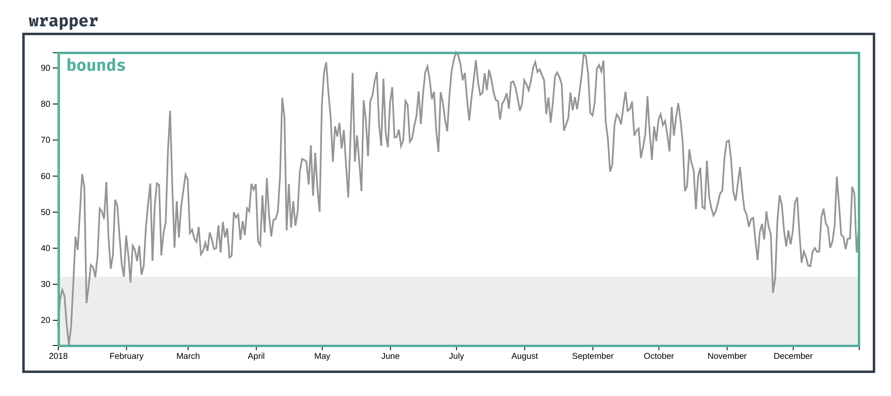
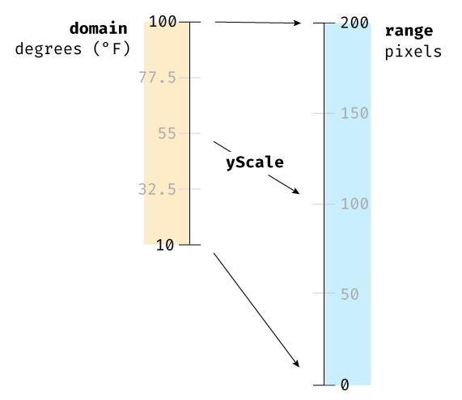

# D3

In this module, we'll create a line chart that plots daily temperature.

Here's what our [line chart](https://dataviz-exercises.netlify.app/temperatures/index.html) will look like when we're finished.

The dataset we'll be analyzing contains 365 days of daily weather metrics. The file is in [JSON]() format and includes 2021 weather data for New York City from the Open Sky weather API.

Create `index.html` in the app folder and add a wrapper div and a link to D3 and `chart.js`:

```html
<!DOCTYPE html>
<html lang="en">
  <head>
    <meta charset="UTF-8" />
    <meta http-equiv="X-UA-Compatible" content="IE=edge" />
    <meta name="viewport" content="width=device-width, initial-scale=1.0" />
    <title>Document</title>
  </head>
  <body>
    <div id="wrapper"></div>

    <script src="https://d3js.org/d3.v7.min.js"></script>
    <script src="./chart.js"></script>
  </body>
</html>
```

## Loading the Data

In `chart.js` define a function named `drawLineChart()` and run it:

```js
async function drawLineChart() {
  // write your code here
}

drawLineChart();
```

The first step to visualizing any dataset is understanding its structure. To get a good look at our data we will load the JSON file that holds our data.

D3.js has methods for fetching and parsing files of different formats in the [d3-fetch module](https://github.com/d3/d3-fetch) - for example, `d3.csv()`, `d3.json()`, and `d3.xml()`.

Since we're working with a JSON file, we want to pass our file path to `d3.json()`.

Let's create a new variable named dataset and use `d3.json()` to load the contents of our JSON file:

```js
async function drawLineChart() {
  const dataset = await d3.json("./data/my_weather_data.json");
  console.log(dataset);
}

drawLineChart();
```

Open `index.html` using Live Server and examine the console.

`await` is a JavaScript keyword that will pauses execution until a Promise is resolved.

Note that the `drawLineChart()` function declaration is preceded by the keyword `async`. `await` will only work within an function maked as `async`.

This means that any code after `await d3.json("./data/my_weather_data.json")` will wait until dataset is defined.

## Examine the Data

Send the first day to the console in tabular form:

`console.table(dataset[0])`

Our dataset is array of objects, with one object per day.

We'll start by looking at `temperatureMax` over time.

Our timeline will have two axes:

1. a y axis (vertical) on the left comprised of max temperature values
1. an x axis (horizontal) on the bottom comprised of dates

To grab the correct metrics from each data point, we'll need accessor functions. Accessor functions convert a single data point into the metric value.

Lets try it out by creating a yAccessor function that will take a data point and return the max temperature.

We will use yAccessor for plotting points on the y axis.

Looking at the data point in our console, we can see that a day's max temperature is located on the object's temperatureMax key. To access this value, our yAccessor function looks like this:

`const yAccessor = d => d.temperatureMax`

Next, we'll need an xAccessor function that will return a point's date, which we will use for plotting points on the x axis.

`const xAccessor = d => d.date`

The date value is a string (eg. "2018-12-25"). Unfortunately, this string won't make sense on our x axis. How could we know how far "2018-12-25" is from "2018-12-29"?

We need to convert the string into a JavaScript Date, which is an object that represents a single point in time. Thankfully, d3 has a d3-time-format module with methods for parsing and formatting dates.

The d3.timeParse() method...

- takes a string specifying a date format, and
- outputs a function that will parse dates of that format.

For example, `d3.timeParse("%Y")` will parse a string with just a year (eg. "2021").

Let's create a date parser function and use it to transform our date strings into date objects:

```js
// import * as d3 from "d3";

async function drawLineChart() {
  const dataset = await d3.json("./data/my_weather_data.json");

  const yAccessor = (d) => d.temperatureMax;
  const dateParser = d3.timeParse("%Y-%m-%d");
  const xAccessor = (d) => dateParser(d.date);
}

drawLineChart();
```

Now when we call `xAccessor(dataset[0])`, we'll get the first day's date.

Defining accessor functions might seem like unnecessary overhead right now, especially with this simple example. However, creating a separate function to read the values from our data points helps us in a few ways.

- Easy changes: every chart is likely to change at least once — whether that change is due to business requirements, design, or data structure. These changing requirements are especially prevalent when creating dashboards with dynamic data, where you might need to handle a new edge case two months later. Having the accessor functions in one place at the top of a chart file makes them easy to update throughout the chart.
- Documentation: having these functions at the top of a file can give you a quick reminder of what metrics the chart is plotting and the structure of the data.
- Framing: sitting down with the data and planning what metrics we'll need to access is a great way to start making a chart. It's tempting to rush in, then two hours later realize that another type of chart would be better suited to the data.

Now that we know how to access our dataset, we need to prepare to draw our chart.

When drawing a chart, there are two containers whose dimensions we need to define: the wrapper and the bounds.



The wrapper contains the entire chart: the data elements, the axes, the labels, etc. Every SVG element will be contained inside here.

The bounds contain all of our data elements: in this case, our line.

This distinction will help us separate the amount of space we need for extraneous elements (axes, labels), and let us focus on our main task: plotting our data. One reason this is so important to define up front is the inconsistent and unfamiliar way SVG elements are sized.

When adding a chart to a webpage, we start with the amount of space we have available for the chart. Then we decide how much space we need for the margins, which will accommodate the chart axes and labels. What's left is how much space we have for our data elements.

We will rarely have the option to decide how large our timeline is and then build up from there. Our charts will need to be accommodating of window sizes, surrounding text, and more.

Let's define a dimensions object that will contain the size of the wrapper and the margins. We'll have one margin defined for each side of the chart: top, right, bottom, and left. For consistency, we'll mimic the order used for CSS properties.

```js
let dimensions = {
  width: window.innerWidth * 0.9,
  height: 400,
  margin: {
    top: 15,
    right: 15,
    bottom: 40,
    left: 60,
  },
};
```

We want a small top and right margin to give the chart some space. The line or the y axis might overflow the chart bounds. We'll want a larger bottom and left margin to create room for our axes.

Let's compute the size of our bounds and add that to our dimensions object.

```js
import * as d3 from "d3";

async function drawLineChart() {
  const dataset = await d3.json("./data/my_weather_data.json");

  const yAccessor = (d) => d.temperatureMax;
  const dateParser = d3.timeParse("%Y-%m-%d");
  const xAccessor = (d) => dateParser(d.date);

  // 2. Create chart dimensions

  let dimensions = {
    width: window.innerWidth * 0.9,
    height: 400,
    margin: {
      top: 15,
      right: 15,
      bottom: 40,
      left: 60,
    },
  };
  dimensions.boundedWidth =
    dimensions.width - dimensions.margin.left - dimensions.margin.right;
  dimensions.boundedHeight =
    dimensions.height - dimensions.margin.top - dimensions.margin.bottom;
}

drawLineChart();
```

To add elements to our page, we'll need to specify an existing element that we want to append to.

Remember the #wrapper element already populated in index.html? One of d3's modules, d3-selection, has helper functions to select from and modify the DOM.

We can use d3.select() , which accepts a CSS-selector-like string and returns the first matching DOM element (if any). If you're unfamiliar with CSS selector syntax, there are three main types of selectors:

- you can select all elements with a class name (.class)
- you can select all elements with an id (#id), or
- you can select all elements of a specific node type (type).

`const wrapper = d3.select("#wrapper")`

```js
import * as d3 from "d3";

async function drawLineChart() {
  const dataset = await d3.json("./data/my_weather_data.json");

  const yAccessor = (d) => d.temperatureMax;
  const dateParser = d3.timeParse("%Y-%m-%d");
  const xAccessor = (d) => dateParser(d.date);

  // 2. Create chart dimensions

  let dimensions = {
    width: window.innerWidth * 0.9,
    height: 400,
    margin: {
      top: 15,
      right: 15,
      bottom: 40,
      left: 60,
    },
  };
  dimensions.boundedWidth =
    dimensions.width - dimensions.margin.left - dimensions.margin.right;
  dimensions.boundedHeight =
    dimensions.height - dimensions.margin.top - dimensions.margin.bottom;

  // 3. Draw canvas

  const wrapper = d3.select("#wrapper");
  console.log(wrapper);
}

drawLineChart();
```

Our wrapper object also has methods for manipulating the linked DOM element — let's use its append method to add a new SVG element.

```js
const wrapper = d3.select("#wrapper");
const svg = wrapper.append("svg");
```

If we log svg to the console, we'll see that it looks like our wrapper object. However, if we expand the \_groups key, we'll see that the linked element is our new <svg> element.

One trick to make sure we're grabbing the correct element is to hover the logged DOM element. If we expand the \_groups object and hover over the <svg> element, the browser will highlight the corresponding DOM element on the webpage.

On hover, the browser will also show the element's size: 300px by 150px. This is the default size for SVG elements in Google Chrome, but it will vary between browsers and even browser versions. SVG elements don't scale the way most DOM elements do — there are many rules that will be unfamiliar to an experienced web developer.

To maintain control, let's tell our <svg> element what size we want it to be.

d3 selection objects have an .attr() method that will add or replace an attribute on the selected DOM element. The first argument is the attribute name and the second argument is the value.

```js
const wrapper = d3.select("#wrapper");
const svg = wrapper.append("svg");
svg.attr("width", dimensions.width);
svg.attr("height", dimensions.height);
```

The value argument to .attr() can either be a constant, which is all we need right now, or a function, which we'll cover later.

Most d3-selection methods will return a selection object.

- any method that selects or creates a new object will return the new selection
- any method that manipulates the current selection will return the same selection

This allows us to keep our code concise by chaining when we're using multiple methods. For example, we can rewrite the above code as:

```js
const wrapper = d3.select("#wrapper");
const svg = wrapper
  .append("svg")
  .attr("width", dimensions.width)
  .attr("height", dimensions.height);
```

In this book, we'll follow the common d3 convention of using 4 space indents for methods that return the same selection. This will make it easy to spot when our selection changes.

Since we're not going to re-use the svg variable, we can rewrite the above code as:

```js
const wrapper = d3
  .select("#wrapper")
  .append("svg")
  .attr("width", dimensions.width)
  .attr("height", dimensions.height);
```

Final code:

```js
import * as d3 from "d3";

async function drawLineChart() {
  const dataset = await d3.json("./data/my_weather_data.json");

  const yAccessor = (d) => d.temperatureMax;
  const dateParser = d3.timeParse("%Y-%m-%d");
  const xAccessor = (d) => dateParser(d.date);

  // 2. Create chart dimensions

  let dimensions = {
    width: window.innerWidth * 0.9,
    height: 400,
    margin: {
      top: 15,
      right: 15,
      bottom: 40,
      left: 60,
    },
  };
  dimensions.boundedWidth =
    dimensions.width - dimensions.margin.left - dimensions.margin.right;
  dimensions.boundedHeight =
    dimensions.height - dimensions.margin.top - dimensions.margin.bottom;

  // 3. Draw canvas

  const wrapper = d3
    .select("#wrapper")
    .append("svg")
    .attr("width", dimensions.width)
    .attr("height", dimensions.height);
}

drawLineChart();
```

Our SVG element is the size we wanted, but we want our chart to respect the margins we specified.

Let's create a group that shifts its contents to respect the top and left margins so we can deal with those in one place.

Any elements inside of an <svg> have to be SVG elements (with the exception of <foreignObject> which is fiddly to work with). Since we'll be inserting new chart elements inside of our <svg>, we'll need to use SVG elements for the rest of the chart.

The <g> SVG element is not visible on its own, but is used to group other elements. Think of it as the <div> of SVG — a wrapper for other elements. We can draw our chart inside of a <g> element and shift it all at once using the CSS transform property.

d3 selection objects have a .style() method for adding and modifying CSS styles. The .style() method is invoked similarly to .attr() and takes a key-value pair as its first and second arguments. Let's use .style() to shift our bounds.

```js
const bounds = wrapper
  .append("g")
  .style(
    "transform",
    `translate(${dimensions.margin.left}px, ${dimensions.margin.top}px)`
  );
```

The <g> element size is 0px by 0px — instead of taking a width or height attribute, a <g> element will expand to fit its contents. When we start drawing our chart, we'll see this in action.

Final:

```js
import * as d3 from "d3";

async function drawLineChart() {
  const dataset = await d3.json("./data/my_weather_data.json");

  const yAccessor = (d) => d.temperatureMax;
  const dateParser = d3.timeParse("%Y-%m-%d");
  const xAccessor = (d) => dateParser(d.date);

  // 2. Create chart dimensions

  let dimensions = {
    width: window.innerWidth * 0.9,
    height: 400,
    margin: {
      top: 15,
      right: 15,
      bottom: 40,
      left: 60,
    },
  };
  dimensions.boundedWidth =
    dimensions.width - dimensions.margin.left - dimensions.margin.right;
  dimensions.boundedHeight =
    dimensions.height - dimensions.margin.top - dimensions.margin.bottom;

  // 3. Draw canvas

  const wrapper = d3
    .select("#wrapper")
    .append("svg")
    .attr("width", dimensions.width)
    .attr("height", dimensions.height);

  const bounds = wrapper
    .append("g")
    .style(
      "transform",
      `translate(${dimensions.margin.left}px, ${dimensions.margin.top}px)`
    );
}

drawLineChart();
```

On our y axis, we want to plot the max temperature for every day.

Before we draw our chart, we need to decide what temperatures we want to visualize. Do we need to plot temperatures over 1,000°F or under 0°F? We could hard-code a standard set of temperatures, but that range could be too large (making the data hard to see), or it could be too small or offset (cutting off the data). Instead, let's use the actual range by finding the lowest and highest temperatures in our dataset.

Note: We've all seen over-dramatized timelines with a huge drop, only to realize that the change is relatively small. When defining an axis, we'll often want to start at 0 to show scale. We'll go over this more when we talk about types of data.

As an example, let's grab a sample day's data — say it has a maximum temperature of 55°F. We could draw our point 55 pixels above the bottom of the chart, but that won't scale with our boundedHeight.

Additionally, if our lowest temperature is below 0 we would have to plot that value below the chart! Our y axis wouldn't be able to handle all of our temperature values.

To plot the max temperature values in the correct spot, we need to convert them into pixel space.

d3's d3-scale module can create different types of scales. A scale is a function that converts values between two domains.

For our y axis, we want to convert values from the temperature domain to the pixel domain. If our chart needs to handle temperatures from 10°F to 100°F, a day with a max of 55°F will be halfway up the y axis.

Let's create a scale that converts those degrees into a y value. If our y axis is 200px tall, the y scale should convert 55°F into 100, the halfway point on the y axis.



d3-scale can handle many different types of scales - in this case, we want to use d3.scaleLinear() because our y axis values will be numbers that increase linearly. To create a new scale, we need to create an instance of d3.scaleLinear().

`const yScale = d3.scaleLinear()`

Our scale needs two pieces of information:

the domain: the minimum and maximum input values
the range: the minimum and maximum output values
Let's start with the domain. We'll need to create an array of the smallest and largest numbers our y axis will need to handle — in this case the lowest and highest max temperature in our dataset.

The d3-array module has a d3.extent() method for grabbing those numbers. d3.extent() takes two parameters:

an array of data points
an accessor function which defaults to an identity function (d => d)
Let's test this out by logging d3.extent(dataset, yAccessor) to the console. The output should be an array of two values: the minimum and maximum temperature in our dataset. Perfect!

Let's plug that into our scale's domain:

```js
const yScale = d3.scaleLinear().domain(d3.extent(dataset, yAccessor));
```

Next, we need to specify the range. As a reminder, the range is the highest and lowest number we want our scale to output — in this case, the maximum & minimum number of pixels our point will be from the x axis. We want to use our boundedHeight to stay within our margins. Remember, SVG y-values count from top to bottom so we want our range to start at the top.

```js
const yScale = d3
  .scaleLinear()
  .domain(d3.extent(dataset, yAccessor))
  .range([dimensions.boundedHeight, 0]);
```

Let's test it by logging some values to the console. At what y value is the freezing point on our chart?

`console.log(yScale(32))`

The outputted number should tell us how far away the freezing point will be from the bottom of the y axis.

Let's visualize this threshold by adding a rectangle covering all temperatures below freezing. The SVG <rect> element can do exactly that. We just need to give it four attributes: x, y, width, and height.

```js
const freezingTemperaturePlacement = yScale(32);
const freezingTemperatures = bounds
  .append("rect")
  .attr("x", 0)
  .attr("width", dimensions.boundedWidth)
  .attr("y", freezingTemperaturePlacement)
  .attr("height", dimensions.boundedHeight - freezingTemperaturePlacement);
```

Now we can see a black rectangle spanning the width of our bounds.

Let's make it a frosty blue to connote "freezing" and decrease its visual importance. You can't style SVG elements with background or border — instead, we can use fill and stroke respectively. We'll discuss the differences later in more depth. As we can see, the default fill for SVG elements is black and the default stroke color is none with a width of 1px.

```js
const freezingTemperatures = bounds
  .append("rect")
  .attr("x", 0)
  .attr("width", dimensions.boundedWidth)
  .attr("y", freezingTemperaturePlacement)
  .attr("height", dimensions.boundedHeight - freezingTemperaturePlacement)
  .attr("fill", "#e0f3f3");
```

Let's look at the rectangle in the Elements panel to see how the .attr() methods manipulated it.

```js
<rect
  x="0"
  width="1530"
  y="325.7509689922481"
  height="24.24903100775191"
  fill="rgb(224, 243, 243)"
></rect>
```

Note: some SVG styles can be set with either a CSS style or an attribute value, such as fill, stroke, and stroke-width. It's up to you whether you want to set them with .style() or .attr(). Once we're familiar with styling our charts, we'll apply classes using .attr("class", "class-name") and add styles to a separate CSS file.

In this code, we're using .attr() to set the fill because an attribute has a lower CSS precedence than linked stylesheets, which will let us overwrite the value. If we used .style(), we'd be setting an inline style which would require an !important CSS declaration to override.

Let's move on and create a scale for the x axis. This will look like our y axis but, since we're working with date objects, we'll use a time scale which knows how to handle date objects.

```js
const xScale = d3
  .scaleTime()
  .domain(d3.extent(dataset, xAccessor))
  .range([0, dimensions.boundedWidth]);
```

Final:

```js
import * as d3 from "d3";

async function drawLineChart() {
  const dataset = await d3.json("./data/my_weather_data.json");

  const yAccessor = (d) => d.temperatureMax;
  const dateParser = d3.timeParse("%Y-%m-%d");
  const xAccessor = (d) => dateParser(d.date);

  // 2. Create chart dimensions

  let dimensions = {
    width: window.innerWidth * 0.9,
    height: 400,
    margin: {
      top: 15,
      right: 15,
      bottom: 40,
      left: 60,
    },
  };
  dimensions.boundedWidth =
    dimensions.width - dimensions.margin.left - dimensions.margin.right;
  dimensions.boundedHeight =
    dimensions.height - dimensions.margin.top - dimensions.margin.bottom;

  // 3. Draw canvas

  const wrapper = d3
    .select("#wrapper")
    .append("svg")
    .attr("width", dimensions.width)
    .attr("height", dimensions.height);

  const bounds = wrapper
    .append("g")
    .style(
      "transform",
      `translate(${dimensions.margin.left}px, ${dimensions.margin.top}px)`
    );

  // 4. Create scales

  const yScale = d3
    .scaleLinear()
    .domain(d3.extent(dataset, yAccessor))
    .range([dimensions.boundedHeight, 0]);

  const freezingTemperaturePlacement = yScale(32);
  const freezingTemperatures = bounds
    .append("rect")
    .attr("x", 0)
    .attr("width", dimensions.boundedWidth)
    .attr("y", freezingTemperaturePlacement)
    .attr("height", dimensions.boundedHeight - freezingTemperaturePlacement)
    .attr("fill", "#e0f3f3");

  const xScale = d3
    .scaleTime()
    .domain(d3.extent(dataset, xAccessor))
    .range([0, dimensions.boundedWidth]);
}

drawLineChart();
```

The timeline itself will be a single path SVG element. path elements take a d attribute (short for data) that tells them what shape to make.

d3's module d3-shape has a d3.line() method that will create a generator that converts data points into a d string.

`const lineGenerator = d3.line()`

Our generator needs two pieces of information:

1. how to find an x axis value, and
2. how to find a y axis value.

We set these values with the x and y method, respectively, which each take one parameter: a function to convert a data point into an x or y value.

We want to use our accessor functions, but remember: our accessor functions return the unscaled value.

We'll transform our data point with both the accessor function and the scale to get the scaled value in pixel space.

```js
const lineGenerator = d3
  .line()
  .x((d) => xScale(xAccessor(d)))
  .y((d) => yScale(yAccessor(d)));
```

Now we're ready to add the path element to our bounds.

`const line = bounds.append("path")`

Let's feed our dataset to our line generator to create the d attribute and tell the line what shape to be.

```js
const line = bounds.append("path").attr("d", lineGenerator(dataset));
```

We have a chart with a line showing our max temperature for the whole year.

SVG elements default to a black fill and no stroke, which is why we see this dark filled-in shape.

```js
const line = bounds
  .append("path")
  .attr("d", lineGenerator(dataset))
  .attr("fill", "none")
  .attr("stroke", "#af9358")
  .attr("stroke-width", 2);
```

Let's finish up by drawing our axes.

Final:

```js
import * as d3 from "d3";

async function drawLineChart() {
  const dataset = await d3.json("./data/my_weather_data.json");

  const yAccessor = (d) => d.temperatureMax;
  const dateParser = d3.timeParse("%Y-%m-%d");
  const xAccessor = (d) => dateParser(d.date);

  // 2. Create chart dimensions

  let dimensions = {
    width: window.innerWidth * 0.9,
    height: 400,
    margin: {
      top: 15,
      right: 15,
      bottom: 40,
      left: 60,
    },
  };
  dimensions.boundedWidth =
    dimensions.width - dimensions.margin.left - dimensions.margin.right;
  dimensions.boundedHeight =
    dimensions.height - dimensions.margin.top - dimensions.margin.bottom;

  // 3. Draw canvas

  const wrapper = d3
    .select("#wrapper")
    .append("svg")
    .attr("width", dimensions.width)
    .attr("height", dimensions.height);

  const bounds = wrapper
    .append("g")
    .style(
      "transform",
      `translate(${dimensions.margin.left}px, ${dimensions.margin.top}px)`
    );

  // 4. Create scales

  const yScale = d3
    .scaleLinear()
    .domain(d3.extent(dataset, yAccessor))
    .range([dimensions.boundedHeight, 0]);

  const freezingTemperaturePlacement = yScale(32);
  const freezingTemperatures = bounds
    .append("rect")
    .attr("x", 0)
    .attr("width", dimensions.boundedWidth)
    .attr("y", freezingTemperaturePlacement)
    .attr("height", dimensions.boundedHeight - freezingTemperaturePlacement)
    .attr("fill", "#e0f3f3");

  const xScale = d3
    .scaleTime()
    .domain(d3.extent(dataset, xAccessor))
    .range([0, dimensions.boundedWidth]);

  // 5. Draw data

  const lineGenerator = d3
    .line()
    .x((d) => xScale(xAccessor(d)))
    .y((d) => yScale(yAccessor(d)));

  const line = bounds
    .append("path")
    .attr("d", lineGenerator(dataset))
    .attr("fill", "none")
    .attr("stroke", "#af9358")
    .attr("stroke-width", 2);
}

drawLineChart();
```

## Drawing the axes

Let's start with the y axis. d3's d3-axis module has axis generator methods which will draw an axis for the given scale.

Unlike the methods we've used before, d3 axis generators will append multiple elements to the page.

There is one method for each orientation, which will specify the placement of labels and tick marks:

- axisTop
- axisRight
- axisBottom
- axisLeft

Following common convention, we want the labels of our y axis to be to the left of the axis line, so we'll use d3.axisLeft() and pass it our y scale.

```js
const yAxisGenerator = d3.axisLeft().scale(yScale);
```

When we call our axis generator, it will create a lot of elements — let's create a g element to hold all of those elements and keep our DOM organized. Then we'll pass that new element to our yAxisGenerator function to tell it where to draw our axis.

```js
const yAxis = bounds.append("g");

yAxisGenerator(yAxis);
```

This method works but it will break up our chained methods. To fix this, d3 selections have a .call() method that will execute the provided function with the selection as the first parameter.

We can use .call() to:

- prevent saving our selection as a variable, and
- preserve the selection for additional chaining

Note that this code does exactly the same thing as the snippet above - we are passing the function yAxisGenerator to .call(), which then runs the function for us.

```js
const yAxis = bounds.append("g").call(yAxisGenerator);
```

We have our first axis.

The small notches perpendicular to the axis are called tick marks. d3 has made behind-the-scenes decisions about how many tick marks to make and how far apart to draw them. We'll learn more about how to customize this later.

Let's create the x axis in the same way, this time using d3.axisBottom().

```js
const xAxisGenerator = d3.axisBottom().scale(xScale);
```

Create another <g> element and draw our axis.

```js
const xAxis = bounds.append("g").call(xAxisGenerator);
```

We could .call() our x axis directly on our bounds:

const xAxis = bounds.call(xAxisGenerator)

This would create our axis directly under our bounds (in the DOM).

However, it's a good idea to create a <g> element to contain our axis elements for three main reasons:

1. to keep our DOM organized, for debugging or exporting
1. if we want to remove or update our axis, we'll want an easy way to target all of the elements
1. modifying our whole axis at once, for example when we want to move it around.

The axis looks right, but it's in the wrong place.

Why didn't .axisBottom() draw the axis in the right place? d3's axis generator functions know where to place the tick marks and tick labels relative to the axis line, but they have no idea where to place the axis itself.

To move the x axis to the bottom, we can shift the x axis group, similar to how we shifted our chart bounds using a CSS transform.

```js
const xAxis = bounds
  .append("g")
  .call(xAxisGenerator)
  .style("transform", `translateY(${dimensions.boundedHeight}px)`);
```

Let's dive into making a slightly more complex chart and talk more about how d3 works for a deeper understanding of the concepts we just learned.

Final:

```js
import * as d3 from "d3";

async function drawLineChart() {
  // 1. Access data
  const dataset = await d3.json("./data/my_weather_data.json");

  const yAccessor = (d) => d.temperatureMax;
  const dateParser = d3.timeParse("%Y-%m-%d");
  const xAccessor = (d) => dateParser(d.date);

  // 2. Create chart dimensions

  let dimensions = {
    width: window.innerWidth * 0.9,
    height: 400,
    margin: {
      top: 15,
      right: 15,
      bottom: 40,
      left: 60,
    },
  };
  dimensions.boundedWidth =
    dimensions.width - dimensions.margin.left - dimensions.margin.right;
  dimensions.boundedHeight =
    dimensions.height - dimensions.margin.top - dimensions.margin.bottom;

  // 3. Draw canvas

  const wrapper = d3
    .select("#wrapper")
    .append("svg")
    .attr("width", dimensions.width)
    .attr("height", dimensions.height);

  const bounds = wrapper
    .append("g")
    .style(
      "transform",
      `translate(${dimensions.margin.left}px, ${dimensions.margin.top}px)`
    );

  // 4. Create scales

  const yScale = d3
    .scaleLinear()
    .domain(d3.extent(dataset, yAccessor))
    .range([dimensions.boundedHeight, 0]);

  const freezingTemperaturePlacement = yScale(32);
  const freezingTemperatures = bounds
    .append("rect")
    .attr("x", 0)
    .attr("width", dimensions.boundedWidth)
    .attr("y", freezingTemperaturePlacement)
    .attr("height", dimensions.boundedHeight - freezingTemperaturePlacement)
    .attr("fill", "#e0f3f3");

  const xScale = d3
    .scaleTime()
    .domain(d3.extent(dataset, xAccessor))
    .range([0, dimensions.boundedWidth]);

  // 5. Draw data

  const lineGenerator = d3
    .line()
    .x((d) => xScale(xAccessor(d)))
    .y((d) => yScale(yAccessor(d)));

  const line = bounds
    .append("path")
    .attr("d", lineGenerator(dataset))
    .attr("fill", "none")
    .attr("stroke", "#af9358")
    .attr("stroke-width", 2);

  // 6. Draw peripherals

  const yAxisGenerator = d3.axisLeft().scale(yScale);

  const yAxis = bounds.append("g").call(yAxisGenerator);

  const xAxisGenerator = d3.axisBottom().scale(xScale);

  const xAxis = bounds
    .append("g")
    .call(xAxisGenerator)
    .style("transform", `translateY(${dimensions.boundedHeight}px)`);
}
drawLineChart();
```
